# Ansible Deployment Workflow

## Overview

Ansible automates all service deployments from the Mac to the `geek` host. It ensures infrastructure is always in the desired state defined by the Git repository.

---

## Architecture

### Deployment Flow

```mermaid
graph LR
    A["📝 Edit Code<br/>or Config on Mac"] -->|"git push"| B["📦 GitHub<br/>homelab-admin repo"]
    B -->|"git pull"| C["🔀 geek host<br/>Ansible pre_tasks"]
    C -->|"Validates"| D["✅ Check<br/>Secrets exist<br/>Ports available"]
    D -->|"Runs Roles"| E["⚙️ 5+ Ansible Roles<br/>docker compose up -d"]
    E -->|"Verifies"| F["🧪 Health Checks<br/>curl endpoints"]
    F -->|"Result"| G["✅ Running<br/>or<br/>❌ Failed"]

    style B fill:#4ecdc4
    style C fill:#FFD93D
    style E fill:#51cf66
    style G fill:#95E1D3
```



---

## Key Concepts

### Pre-Tasks: Auto Git Sync

Before any roles run, `site.yml` executes:

```yaml
pre_tasks:
  - name: Sync homelab-admin repo on geek
    ansible.builtin.git:
      repo: https://github.com/johnboyce/homelab-admin.git
      dest: /home/johnb/homelab-admin
      version: main
      update: yes
      force: no
    become: no
    tags: always
```

**Why:** Ensures geek has the latest code from Mac before deploying.

**Result:** `/home/johnb/homelab-admin/` always reflects `main` branch.

### Privilege Escalation (become: yes)

Most Ansible tasks require `root` privileges to:
- Read `/etc/homelab/secrets/` (directory is `drwx------ 700`)
- Access `/srv/homelab/` volumes (owned by root or specific UIDs)
- Execute `docker compose up -d` with elevated permissions

```yaml
# In each role's main.yml
- name: Deploy BookStack
  community.docker.docker_compose_v2:
    project_src: /home/johnb/homelab-admin/platform/bookstack
    state: present
  become: yes  # ← Essential for accessing secrets directory
  register: result
```

**How it works:** Ansible connects as `johnb`, then `sudo su` internally to execute privileged tasks.

---

## Ansible Roles

### Directory Structure

```
ansible/
├── playbooks/
│   ├── site.yml                    # Main playbook (all hosts)
│   ├── docker.yml                  # Docker daemon setup
│   ├── firewall.yml                # UFW rules
│   ├── nginx.yml                   # nginx deployment
│   └── status.yml                  # Health checks
│
├── roles/
│   ├── authentik/                  # Authentik SSO (server, worker, outpost)
│   ├── bookstack/                  # BookStack wiki
│   ├── postgres/                   # PostgreSQL database
│   ├── redis/                       # Redis cache
│   ├── pihole/                      # Pi-hole DNS
│   ├── cloudflare_ddns/            # DDNS service
│   ├── nginx/                       # nginx reverse proxy
│   ├── docker_infra/               # Docker network setup
│   └── firewall/                    # UFW firewall rules
│
├── inventory/
│   ├── hosts.ini                   # Host definitions (geek)
│   ├── group_vars/
│   │   └── all.yml                 # Shared variables (ports, service names, etc.)
│   └── host_vars/
│       └── geek.yml                # Host-specific variables
```

### Role Anatomy

Each role (e.g., `authentik/`) contains:

```
authentik/
├── tasks/
│   └── main.yml                    # Deployment steps
├── handlers/
│   └── main.yml                    # Triggered actions (rarely used)
├── files/
│   └── (config files, if any)
└── templates/
    └── (Jinja2 templates, if any)
```

### Standard Role Workflow

Every role's `tasks/main.yml` follows this pattern:


### Example: BookStack Role

**File:** `ansible/roles/bookstack/tasks/main.yml`

```yaml
- name: Check BookStack secrets
  stat:
    path: /etc/homelab/secrets/bookstack.env
  register: bookstack_env
  become: yes

- name: Fail if secrets missing
  fail:
    msg: "BookStack secrets not found at /etc/homelab/secrets/bookstack.env"
  when: not bookstack_env.stat.exists

- name: Create BookStack data directories
  file:
    path: "{{ item }}"
    state: directory
    mode: '0755'
    owner: root
    group: root
  loop:
    - /srv/homelab/bookstack
    - /srv/homelab/bookstack/config
    - /srv/homelab/bookstack/uploads
  become: yes

- name: Deploy BookStack via docker-compose
  community.docker.docker_compose_v2:
    project_src: /home/johnb/homelab-admin/platform/bookstack
    state: present
  become: yes
  register: bookstack_result

- name: Wait for BookStack to be healthy
  uri:
    url: http://localhost:8080
    status_code: [200, 302]
  retries: 10
    delay: 5
  register: result
  until: result.status in [200, 302]
  become: no
```

---

## Deployment Commands

### Full System Dry-Run

```bash
make ansible-dry-run
```

Shows **exactly** what would change without making changes.

Output example:
```
PLAY [All Hosts] ***
TASK [docker_infra : Create geek-infra network] ***
changed: [geek] => {...}

TASK [postgres : Check PostgreSQL secrets] ***
ok: [geek] => {...}

...
```

### Deploy Everything

```bash
make ansible-apply
```

Executes all roles in sequence:
1. `docker_infra` (network setup)
2. `postgres` (database)
3. `authentik` (identity)
4. `bookstack` (wiki)
5. `pihole` (DNS)
6. `redis` (cache, optional)
7. `cloudflare_ddns` (DDNS)
8. `nginx` (reverse proxy)
9. `firewall` (UFW rules)

### Deploy Single Service

```bash
make ansible-apply --tags <service>
```

Examples:
```bash
# Deploy only BookStack
make ansible-apply --tags bookstack

# Deploy Authentik and PostgreSQL
make ansible-apply --tags postgres,authentik
```

### View Current State (Read-Only)

```bash
make ansible-status
```

Checks if services are running without modifying anything.

---

## Secrets Integration

### How Ansible Accesses Secrets


### Secret File Checklist

Before running `make ansible-apply`, verify all required secrets exist on geek:

```bash
ssh geek "ls -la /etc/homelab/secrets/"
```

Expected files:
- [ ] `pihole.env`
- [ ] `authentik.env`
- [ ] `bookstack.env`
- [ ] `postgres.env`
- [ ] `cloudflare-ddns.env`

If any are missing, create them manually on geek:
```bash
ssh geek "cp ~/homelab-admin/platform/bookstack/.env.example /etc/homelab/secrets/bookstack.env"
# Then edit to add actual values
ssh geek "sudo nano /etc/homelab/secrets/bookstack.env"
```

### Secrets Directory Permissions

```bash
# On geek, verify correct permissions
sudo ls -ld /etc/homelab/secrets/
# Expected output: drwx------ root root

sudo ls -l /etc/homelab/secrets/
# Expected output: -rw-r--r-- for each .env file
```

If permissions are wrong:
```bash
sudo chmod 700 /etc/homelab/secrets/
sudo chmod 644 /etc/homelab/secrets/*.env
sudo chown -R root:root /etc/homelab/secrets/
```

---

## Common Workflows

### Workflow 1: Update Service Configuration


### Workflow 2: Update Secrets (Emergency)

If a secret rotates (e.g., Cloudflare API token):

```bash
# 1. SSH to geek and edit secrets
ssh geek
sudo nano /etc/homelab/secrets/cloudflare-ddns.env
# Edit CLOUDFLARE_API_TOKEN value

# 2. Back on Mac, restart the service
make ansible-apply --tags cloudflare_ddns

# 3. Verify it picked up the new token
ssh geek "docker logs geek-cloudflare-ddns"
```

### Workflow 3: Add New Service

1. Create `platform/newservice/docker-compose.yml`
2. Create `platform/newservice/.env.example`
3. Create `/etc/homelab/secrets/newservice.env` on geek (with real values)
4. Create `ansible/roles/newservice/tasks/main.yml`
5. Add role to `ansible/playbooks/site.yml`
6. Test: `make ansible-dry-run`
7. Deploy: `make ansible-apply --tags newservice`

---

## Troubleshooting

### Symptom: "Permission denied" during ansible-apply

**Cause:** Ansible couldn't escalate to root

**Fix:**
```bash
# Verify SSH key access
ssh geek "sudo whoami"

# If password prompt, add key to geek's authorized_keys
ssh-copy-id -i ~/.ssh/id_rsa.pub johnb@geek
```

### Symptom: "env_file not found" error

**Cause:** Secrets don't exist on geek

**Fix:**
```bash
# Check what's missing
ssh geek "ls -la /etc/homelab/secrets/"

# Create missing file
ssh geek "cp ~/homelab-admin/platform/XXX/.env.example /etc/homelab/secrets/XXX.env"

# Edit with real values
ssh geek "sudo nano /etc/homelab/secrets/XXX.env"

# Re-run ansible-apply
make ansible-apply
```

### Symptom: Service stays in "created" state, doesn't start

**Cause:** Health check failing, or service has unmet dependencies

**Fix:**
```bash
# Check service logs
ssh geek "docker logs geek-<service>"

# Check docker-compose status
ssh geek "cd ~/homelab-admin/platform/<service> && docker compose ps"

# Restart service
make ansible-apply --tags <service>
```

### Symptom: Ansible task is very slow

**Cause:** `become: yes` has password prompt (if using password auth)

**Fix:** Use SSH key-based authentication (no password prompts).

---

## Variables and Configuration

### Global Variables

**File:** `ansible/inventory/group_vars/all.yml`

Contains centralized configuration for all hosts:
- Service ports
- Service names
- Environment paths
- Container image versions

Example:
```yaml
authentik_port: 9000
bookstack_port: 8080
postgres_port: 5432
redis_port: 6379

geek_infra_network: geek-infra
homelab_base_path: /home/johnb/homelab-admin
secrets_path: /etc/homelab/secrets
data_path: /srv/homelab
```

These variables are used in role tasks via `{{ variable_name }}`.

### Host-Specific Variables

**File:** `ansible/inventory/host_vars/geek.yml`

Variables specific to the `geek` host (rarely used, but available for per-host customization).

---

## Future Enhancements

### Ansible Vault (Coming Soon)

Currently, secrets are manually managed in `/etc/homelab/secrets/`. The future plan is to:

1. Move secrets into `ansible/group_vars/vault.yml` (encrypted)
2. Ansible automatically decrypts and applies them
3. No manual secret file management needed

This requires:
```bash
ansible-vault create ansible/group_vars/vault.yml
# (enter password)
```

And running playbooks with:
```bash
ansible-playbook playbooks/site.yml --ask-vault-pass
```

### Health Check Playbook

Add a new `health-check.yml` playbook that:
- Tests each service endpoint
- Checks database connectivity
- Validates certificate expiration
- Sends alerts if issues found

### Idempotence Improvements

Some tasks aren't fully idempotent yet. Future improvements:
- Use `changed_when` to avoid false "changed" status
- Add more conditional checks before destructive operations
- Implement proper state validation

---

## Best Practices

### ✅ DO

- ✅ Always run `make ansible-dry-run` before `make ansible-apply`
- ✅ Test secrets exist before deploying: `ssh geek "ls /etc/homelab/secrets/"`
- ✅ Tag tasks for granular control: `--tags service1,service2`
- ✅ Use `become: yes` for privileged tasks
- ✅ Validate in small increments, not all at once
- ✅ Check service logs after deployment: `ssh geek "docker logs"`

### ❌ DON'T

- ❌ Skip the dry-run step
- ❌ Edit Ansible tasks without testing first
- ❌ Commit real secrets to the repo
- ❌ Run playbooks without `--tags` if you only need one service
- ❌ Assume services are healthy without health checks
- ❌ Modify geek's `/home/johnb/homelab-admin/` manually (let Ansible sync it)

---

## Related Documentation

- **[Infrastructure Overview](BOOKSTACK_INFRASTRUCTURE.md)** → Service architecture and volumes
- **[TLS Certificates](TLS_CERTIFICATES.md)** → Certificate renewal and security
- **[Troubleshooting](TROUBLESHOOTING.md)** → Common issues and fixes

---

**Last Updated:** 2026-02-22
**Ansible Version:** 2.10+
**Deployment Method:** Pull-based from geek host
**Maintenance Owner:** John Boyce
