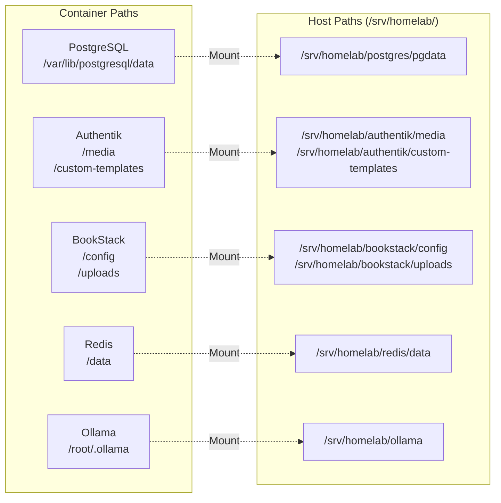
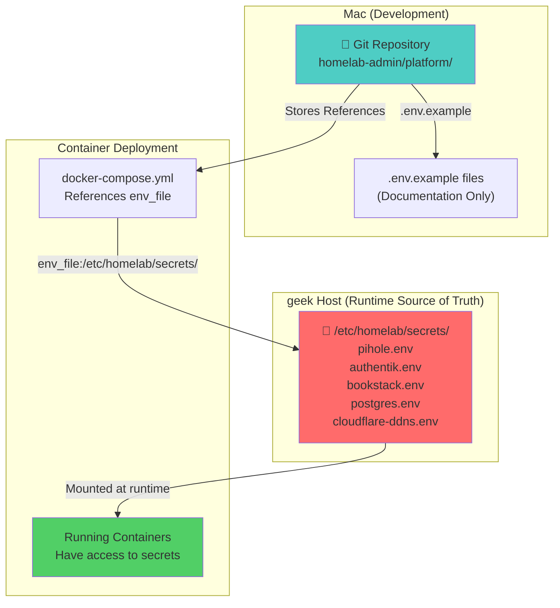
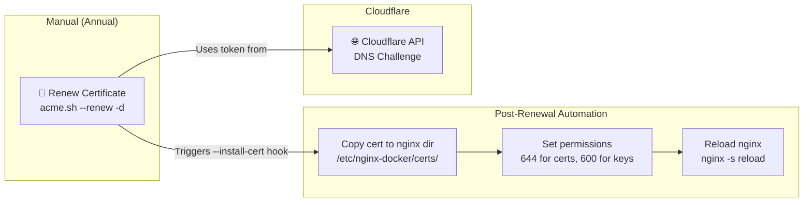
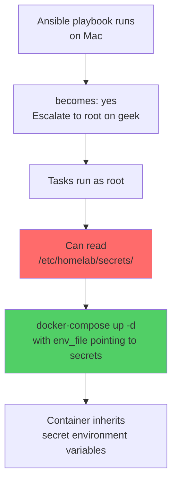
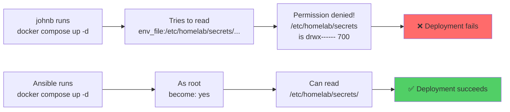
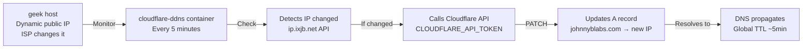
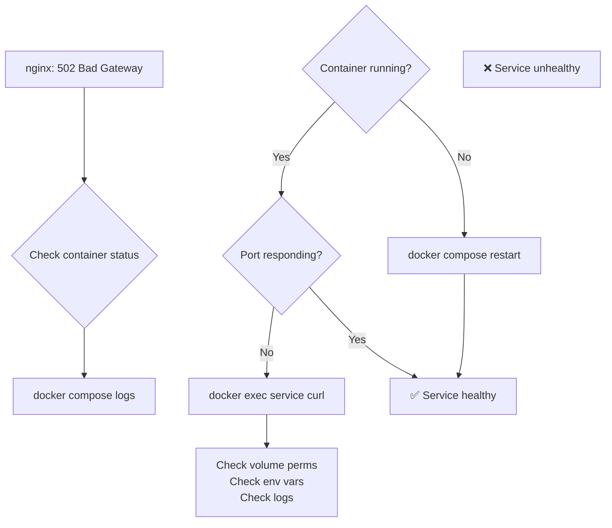

# Homelab Infrastructure Documentation

## 1. Architecture Overview

### Service Topology

```mermaid
graph TB
    subgraph "Internet"
        Internet["🌐 Internet Users"]
    end

    subgraph "geek Host"
        subgraph "nginx Reverse Proxy"
            nginx["🔒 nginx<br/>Port 80/443<br/>TLS Termination"]
        end

        subgraph "Services on geek-infra Network"
            subgraph "Identity & Auth"
                auth_server["Authentik Server<br/>Port 9000"]
                auth_worker["Authentik Worker"]
                auth_outpost["Authentik Outpost<br/>Port 9000"]
            end

            subgraph "Applications"
                bookstack["BookStack<br/>Wiki/Docs"]
                pihole["Pi-hole<br/>DNS/Ad-block"]
                ollama["Ollama<br/>LLM Models"]
            end

            subgraph "Shared Data Layer"
                postgres["🗄️ PostgreSQL<br/>Port 5432"]
                redis["⚡ Redis<br/>Port 6379<br/>(optional)"]
            end
        end

        subgraph "External Services"
            ddns["Cloudflare DDNS<br/>Updates IP Records"]
        end
    end

    Internet -->|HTTPS auth.johnnyblabs.com| nginx
    Internet -->|HTTPS bookstack.johnnyblabs.com| nginx

    nginx -->|HTTP auth.geek| auth_outpost
    nginx -->|HTTP bookstack.geek| bookstack
    nginx -->|HTTP pihole.geek| pihole
    nginx -->|HTTP ollama.geek| ollama

    auth_outpost -->|API| auth_server
    auth_server -->|RPC| auth_worker
    auth_server -->|DB| postgres
    auth_worker -->|DB| postgres

    bookstack -->|DB| postgres
    pihole -->|Cache| redis

    ddns -->|API| Internet
```

---

## 2. Data Volume Structure

All service data is stored in standardized locations on the host at `/srv/homelab/`.

### Volume Mapping



### Directory Permissions

```
/srv/homelab/
├── postgres/pgdata/          → uid:gid 999:999    (postgres in container)
├── authentik/media/          → uid:gid root:root  (docker manages)
├── authentik/custom-templates/ → uid:gid root:root
├── bookstack/config/         → uid:gid 1000:1000  (app user)
├── bookstack/uploads/        → uid:gid 1000:1000
├── redis/data/               → uid:gid redis:redis (docker manages)
└── ollama/                   → uid:gid 999:999    (ollama user)
```

---

## 3. Secrets Management

### Secrets Architecture



### Key Secret Files on geek

| File | Service | Key Variables |
|------|---------|---|
| `pihole.env` | Pi-hole DNS | `WEBPASSWORD`, `TZ` |
| `authentik.env` | Authentik SSO | `AUTHENTIK_TOKEN`, `AUTHENTIK_SECRET_KEY`, `AUTHENTIK_POSTGRESQL__PASSWORD` |
| `bookstack.env` | BookStack Wiki | `DB_PASSWORD`, `APP_KEY`, `OIDC_CLIENT_SECRET` |
| `postgres.env` | PostgreSQL | `POSTGRES_PASSWORD` |
| `cloudflare-ddns.env` | DDNS Service | `CLOUDFLARE_API_TOKEN`, `DOMAINS` |

### Directory Permissions (Security)

```
/etc/homelab/secrets/
├── Directory:   drwx------ (700)   → Only root can read/traverse
├── Files:       -rw-r--r-- (644)   → Docker (running as root) can read
└── Owner:       root:root
```

**Why this matters:**
- Docker containers run with elevated privileges (often as root) when deployed via Ansible
- Regular user `johnb` cannot read secrets (good: prevents accidental leaks)
- Services deployed via `docker compose up -d` as `johnb` fail (need `sudo` or Ansible)

---

## 4. TLS/HTTPS Certificate Management

### Certificate Renewal Flow



### Certificate Details

| Domain | Valid Until | Renewal Status |
|--------|---|---|
| `johnnyblabs.com` | 2025-11 | ✅ Cloudflare auto-renew enabled |
| `*.johnnyblabs.com` | 2025-11 | ✅ Wildcard covered by above |

### Renewal Commands

```bash
# Test renewal (dry-run)
cd ~/.acme.sh
./acme.sh --renew -d "johnnyblabs.com" --dns dns_cf --force

# Check expiration
openssl x509 -in /etc/nginx-docker/certs/johnnyblabs.crt -noout -enddate

# Manual reload if needed
docker exec geek-nginx nginx -s reload
```

---

## 5. Deployment Workflow

### Mac → geek (The Normal Way: via Ansible)

```mermaid
graph LR
    A["📝 Edit Compose<br/>or Config on Mac"] -->|"git push"| B["📦 GitHub<br/>homelab-admin"]
    B -->|"Pull on geek"| C["🔀 Ansible pre_tasks<br/>git pull latest"]
    C -->|"Apply Roles"| D["⚙️ Ansible Roles<br/>authentik, bookstack,<br/>postgres, etc"]
    D -->|"Validate Secrets"| E["🔐 Check /etc/homelab/secrets/"]
    E -->|"docker compose"| F["🚀 Deploy Containers<br/>docker compose up -d"]
    F -->|"Verify"| G["✅ Health Check<br/>curl endpoints"]

    style B fill:#4ecdc4
    style F fill:#51cf66
    style E fill:#ff6b6b
```



### Ansible Playbooks & Roles

```
ansible/
├── playbooks/
│   ├── site.yml                    # Main playbook (includes pre_tasks for git sync)
│   ├── docker.yml                  # Docker setup
│   ├── firewall.yml                # UFW rules
│   ├── nginx.yml                   # nginx deployment
│   └── status.yml                  # Health check
│
└── roles/
    ├── authentik/                  # Authentik server, worker, outpost
    ├── bookstack/                  # BookStack wiki
    ├── postgres/                   # PostgreSQL database
    ├── pihole/                      # Pi-hole DNS
    ├── redis/                       # Redis cache
    ├── cloudflare_ddns/            # DDNS IP updater
    ├── nginx/                       # nginx reverse proxy
    ├── docker_infra/               # Docker network setup
    └── firewall/                    # UFW firewall rules
```

### Deployment Commands

```bash
# Dry-run (show what WOULD change)
make ansible-dry-run

# Deploy everything
make ansible-apply

# Deploy specific service
make ansible-apply --tags bookstack
make ansible-apply --tags authentik
make ansible-apply --tags postgres
```

---

## 6. Secrets Deployment via Ansible

### How Ansible Handles Secrets



### Why Not `docker compose up -d` as johnb?



---

## 7. Dynamic IP & DDNS

### Cloudflare DDNS Flow



### DDNS Container Details

```yaml
Service: cloudflare-ddns
Image: favonia/cloudflare-ddns:latest
Restart: unless-stopped
Security: read_only, no-new-privileges
Update Interval: Every 5 minutes
IPv6: Disabled (geek has no IPv6)

Secrets: /etc/homelab/secrets/cloudflare-ddns.env
  - CLOUDFLARE_API_TOKEN
  - DOMAINS=johnnyblabs.com
```

---

## 8. Troubleshooting Guide

### Symptom: Service returns 502 Bad Gateway



### Symptom: 404 on auth.johnnyblabs.com (after restarting many containers)

**Cause:** nginx DNS cache has stale container IP

**Fix:**
```bash
docker exec geek-nginx nginx -s reload
```

### Symptom: Permission Denied on /etc/homelab/secrets/

**Cause:** Running as `johnb` instead of root

**Fix:**
```bash
# ❌ Wrong
docker compose up -d

# ✅ Correct
sudo docker compose up -d

# ✅✅ Best (use Ansible)
make ansible-apply --tags <service>
```

### Symptom: Authentik "Server Error" after volume migration

**Cause:** PostgreSQL pgdata ownership is not UID 999

**Fix:**
```bash
sudo chown -R 999:999 /srv/homelab/postgres/pgdata
docker compose -f platform/postgres/docker-compose.yml restart
docker compose -f platform/authentik/docker-compose.yml restart
```

### Symptom: "connection to server at "geek-postgres"... failed"

**Cause:** Service trying to reach PostgreSQL before it's ready

**Fix:**
```bash
# Restart only postgres first
make ansible-apply --tags postgres

# Wait 30 seconds, then restart dependent services
make ansible-apply --tags authentik
make ansible-apply --tags bookstack
```

---

## 9. Important File Locations

### On geek Host

```
/home/johnb/homelab-admin/              # Git repo (pulled via Ansible pre_tasks)
/etc/homelab/secrets/                   # Secrets directory (root:root 700)
├── pihole.env
├── authentik.env
├── bookstack.env
├── postgres.env
└── cloudflare-ddns.env

/srv/homelab/                            # Persistent volumes
├── postgres/pgdata/
├── authentik/{media,custom-templates}
├── bookstack/{config,uploads}
├── redis/data/
└── ollama/

/etc/nginx-docker/                       # nginx config (live)
├── nginx.conf
├── conf.d/
├── sites-available/
├── sites-enabled/                       # Symlinks (managed on host)
└── certs/                               # TLS certificates & keys
```

### On Mac (Git Repo)

```
~/homelab-admin/
├── platform/
│   ├── authentik/
│   │   ├── docker-compose.yml           # References secrets
│   │   └── .env.example
│   ├── bookstack/
│   ├── postgres/
│   ├── redis/
│   ├── ingress/nginx/
│   │   └── etc-nginx-docker/            # Mirrored from host
│   └── cloudflare-ddns/
│       └── .env.example
│
├── ansible/
│   ├── playbooks/
│   │   └── site.yml                     # Main: includes pre_tasks git sync
│   └── roles/
│       ├── authentik/
│       ├── bookstack/
│       └── ...
│
└── docs/
    ├── INFRASTRUCTURE.md                # This file
    ├── TROUBLESHOOTING.md
    └── TLS_CERTS.md
```

---

## 10. Key Principles (Never Forget)

### ✅ DO

- ✅ Keep git repo as the source of truth
- ✅ Use Ansible to deploy from Mac → geek
- ✅ Test nginx config before deploying: `make nginx-test`
- ✅ Check secrets exist on geek before Ansible apply
- ✅ Run `docker exec geek-nginx nginx -s reload` after multiple restarts
- ✅ Verify TLS with: `curl -Ik https://auth.johnnyblabs.com`
- ✅ Use `/srv/homelab/` for all persistent data
- ✅ Keep private keys off the Mac (exist only on geek)

### ❌ DON'T

- ❌ Manually edit `/etc/nginx-docker/` on geek (use repo → deploy)
- ❌ Commit real `.env` files or secrets to git
- ❌ Run `docker compose up -d` as `johnb` (secrets need root)
- ❌ Use relative paths like `./pgdata` (use absolute `/srv/homelab/`)
- ❌ Change ownership of entire `~/homelab-admin/` tree (breaks pgdata permissions)
- ❌ Deploy without running `make ansible-dry-run` first
- ❌ Expose service ports directly; all ingress goes through nginx
- ❌ Keep the Cloudflare API token anywhere except `/etc/homelab/secrets/`

---

## 11. Quick Reference Commands

### Service Management

```bash
# View service status
make ansible-status

# Deploy all services (with pre-check)
make ansible-dry-run          # Check what will change
make ansible-apply            # Apply changes

# Deploy one service
make ansible-apply --tags bookstack

# View logs from geek
ssh geek "docker compose -f ~/homelab-admin/platform/authentik logs -f"
```

### nginx Management

```bash
# Test config syntax (on geek via container)
make nginx-test

# Deploy updated config and reload
make nginx-deploy

# Reload nginx (flush DNS cache)
docker exec geek-nginx nginx -s reload
```

### Verification

```bash
# Check all services running
docker ps

# Test internal connectivity
docker exec geek-nginx curl -I http://authentik-outpost:9000/outpost.goauthentik.io/ping

# Test public HTTPS
curl -Ik https://auth.johnnyblabs.com
curl -Ik https://bookstack.johnnyblabs.com
```

### Database

```bash
# Access PostgreSQL
docker exec -it geek-postgres psql -U postgres -d postgres

# List databases
\l

# Connect to authentik DB
\c authentik

# Check tables
\dt
```

---

**Last Updated:** 2026-02-22
**Maintained By:** Homelab Admin Repository
**Version:** 2.0 (Post-Migration to /srv/homelab/)
