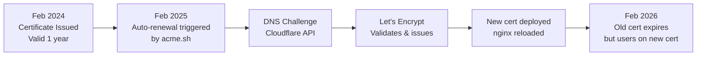

# TLS/HTTPS Certificate Management

## Overview

This homelab uses **Cloudflare DNS** for automated certificate renewal via **acme.sh**. Certificates are issued by Let's Encrypt using the DNS-01 challenge method.

---

## Certificate Details

### Current Certificates

| Domain | Type | Issuer | Valid Until | Renewal |
|--------|------|--------|---|---|
| `johnnyblabs.com` | Wildcard | Let's Encrypt | 2025-11 | ✅ Auto-renew via acme.sh |
| `*.johnnyblabs.com` | Wildcard | Let's Encrypt | 2025-11 | ✅ Covered by above |

### Key Locations

```
/etc/nginx-docker/certs/
├── johnnyblabs.crt          (644) → Public certificate
├── johnnyblabs.key          (600) → PRIVATE KEY - Never commit
└── .keep                          → Placeholder file only in repo
```

**Security Note:** Private key `.key` file is **only on geek host** and never enters the Git repository.

---

## Renewal Process

### Automatic (Annual) Renewal via acme.sh

```mermaid
graph LR
    A["acme.sh scheduler<br/>Annual renewal"] -->|"Triggered"| B["acme.sh --renew<br/>-d johnnyblabs.com"]
    B -->|"DNS Challenge"| C["Cloudflare API<br/>CLOUDFLARE_API_TOKEN"]
    C -->|"Validates domain"| D["Let's Encrypt<br/>Issues new cert"]
    D -->|"Success"| E["--install-cert hook<br/>Post-renewal automation"]
    E -->|"Copy cert"| F["cp to /etc/nginx-docker/certs/"]
    F -->|"Set perms"| G["644 for .crt<br/>600 for .key"]
    G -->|"Reload"| H["docker exec nginx<br/>nginx -s reload"]
    H -->|"Active"| I["✅ New cert in use"]

    style C fill:#FFB81C
    style D fill:#0052CC
    style I fill:#51cf66
```



### Manual Renewal (Testing/Emergency)

```bash
# Navigate to acme.sh directory
cd ~/.acme.sh

# Test renewal (dry-run, doesn't commit cert)
./acme.sh --renew -d "johnnyblabs.com" --dns dns_cf --force

# Check certificate expiration
openssl x509 -in /etc/nginx-docker/certs/johnnyblabs.crt -noout -enddate

# Manual reload if needed (flushes nginx cache)
docker exec geek-nginx nginx -s reload
```

---

## Setup History & Configuration

### acme.sh Installation

acme.sh was installed in `~/.acme.sh/` with:
- Cloudflare DNS plugin (`dns_cf`)
- Auto-install hook for post-renewal automation
- Cron job scheduled for annual renewal

### Environment Variables

**`CLOUDFLARE_API_TOKEN`**
- Stored in: `/root/.bashrc` (on geek, for acme.sh scheduler)
- Also stored in: `/etc/homelab/secrets/cloudflare-ddns.env` (for container)
- **Purpose:** Authenticate with Cloudflare API for DNS-01 challenges

### --install-cert Hook

After renewal succeeds, acme.sh automatically:

1. Copies certificate to `/etc/nginx-docker/certs/johnnyblabs.crt`
2. Copies private key to `/etc/nginx-docker/certs/johnnyblabs.key`
3. Sets permissions:
   - Certificate: `644` (world-readable, needed by nginx)
   - Private key: `600` (only owner, root)
4. Reloads nginx: `nginx -s reload`

**Hook registration command:**
```bash
./acme.sh --install-cert \
  -d johnnyblabs.com \
  --cert-file /etc/nginx-docker/certs/johnnyblabs.crt \
  --key-file /etc/nginx-docker/certs/johnnyblabs.key \
  --reloadcmd "docker exec geek-nginx nginx -s reload"
```

---

## nginx Configuration

### Certificate Usage

```nginx
# /etc/nginx-docker/nginx.conf
ssl_certificate /etc/nginx-docker/certs/johnnyblabs.crt;
ssl_certificate_key /etc/nginx-docker/certs/johnnyblabs.key;
ssl_protocols TLSv1.2 TLSv1.3;
ssl_ciphers HIGH:!aNULL:!MD5;
```

### Virtual Hosts Using TLS

- `auth.johnnyblabs.com` → HTTPS, TLS-terminated by nginx
- `bookstack.johnnyblabs.com` → HTTPS, TLS-terminated by nginx
- Any `*.johnnyblabs.com` → Covered by wildcard certificate

### Internal (LAN) Domains

Internal `.geek` domains use **HTTP only** (no TLS):
- `auth.geek`
- `bookstack.geek`
- `pihole.geek`

(Self-signed certs are not needed; LAN traffic is on trusted network)

---

## Common Tasks

### Check Current Certificate Validity

```bash
openssl x509 -in /etc/nginx-docker/certs/johnnyblabs.crt -noout -dates
```

Output:
```
notBefore=Feb 22 14:30:00 2024 GMT
notAfter=Nov 20 14:30:00 2025 GMT
```

### View Certificate Details

```bash
openssl x509 -in /etc/nginx-docker/certs/johnnyblabs.crt -noout -text
```

Shows: issuer, validity dates, public key info, subject alt names.

### Test HTTPS Endpoint

```bash
# Simple connectivity test
curl -Ik https://auth.johnnyblabs.com

# Verbose with certificate info
curl -Iv https://auth.johnnyblabs.com

# Check certificate chain
openssl s_client -connect auth.johnnyblabs.com:443 -showcerts
```

### Force Immediate Renewal (Not Recommended)

```bash
cd ~/.acme.sh

# Force renewal (normally acme.sh waits 60 days before allowing renewal)
./acme.sh --renew -d "johnnyblabs.com" --dns dns_cf --force
```

**⚠️ Warning:** Renewing too frequently may trigger rate limits at Let's Encrypt.

### Reload nginx (Flush DNS Cache)

After any container restarts, nginx's DNS cache may be stale. Force reload:

```bash
docker exec geek-nginx nginx -s reload
```

**Why:** When Authentik or other services restart, their internal container IPs change. nginx caches old IPs; reload forces re-resolution.

---

## Troubleshooting

### Symptom: Certificate Expired or Invalid

**Step 1:** Check current expiration
```bash
openssl x509 -in /etc/nginx-docker/certs/johnnyblabs.crt -noout -enddate
```

**Step 2:** Check if renewal already happened
```bash
ls -la /etc/nginx-docker/certs/
```
Look at modification times. If recent, reload might not have completed.

**Step 3:** Manually trigger renewal
```bash
cd ~/.acme.sh
./acme.sh --renew -d "johnnyblabs.com" --dns dns_cf --force
```

**Step 4:** Verify renewal succeeded
```bash
docker logs geek-nginx | tail -20
curl -Iv https://auth.johnnyblabs.com
```

### Symptom: ACME Renewal Fails (DNS Challenge)

**Cause:** Cloudflare API token invalid or rotated

**Fix:**
1. Generate new token in Cloudflare dashboard
2. Update `/root/.bashrc` with new `CLOUDFLARE_API_TOKEN`
3. Re-test:
   ```bash
   source ~/.bashrc
   cd ~/.acme.sh
   ./acme.sh --renew -d "johnnyblabs.com" --dns dns_cf --force
   ```

### Symptom: "Permission Denied" Writing to /etc/nginx-docker/certs/

**Cause:** /etc/nginx-docker/certs owned by root, acme.sh running as non-root

**Fix:**
```bash
sudo chown -R johnb:johnb /etc/nginx-docker/certs/
```

### Symptom: Browser Shows "Certificate Not Trusted"

**Cause:** nginx is still serving old certificate

**Fix:**
```bash
# Reload nginx to pick up new cert
docker exec geek-nginx nginx -s reload

# Verify new cert is active
curl -Iv https://auth.johnnyblabs.com | grep "subject="
```

---

## Certificate Rotation Strategy

### Annual Renewal (Recommended)



### Automated Schedule

- **Renewal check:** Daily (via cron in acme.sh)
- **Actual renewal:** When expiration < 60 days (configurable)
- **Post-renewal:** Automatic via hook (copy, chmod, reload)

---

## Security Considerations

### Private Key Protection

```
Owner:      root:root
Permissions: 600 (read/write by owner only)
Location:   /etc/nginx-docker/certs/johnnyblabs.key
Backed up:  On host geek (not in Git, not on Mac)
```

**If private key is leaked:**
1. Revoke certificate immediately (via Cloudflare/Let's Encrypt)
2. Generate new API token in Cloudflare
3. Force renewal: `./acme.sh --renew -d "johnnyblabs.com" --dns dns_cf --force`
4. Update Cloudflare token in `~/.bashrc` (on geek)

### Certificate Pinning

⚠️ **Not Recommended:** Don't pin certificates in client code. Certificate renewal breaks pinning. Better to pin the CA (Let's Encrypt) or use HPKP headers (with caution).

### Monitoring Certificate Expiration

**Manual check (weekly):**
```bash
# Add to crontab
0 0 * * 0 openssl x509 -in /etc/nginx-docker/certs/johnnyblabs.crt -noout -enddate >> /var/log/cert-check.log
```

**Automated alert (future enhancement):**
Consider adding an Ansible task to check expiration and alert via email/Slack if < 30 days.

---

## Related Documentation

- **[Infrastructure Overview](BOOKSTACK_INFRASTRUCTURE.md)** → Service architecture, volumes, secrets
- **[Ansible Deployment](ANSIBLE_DEPLOYMENT.md)** → How services are deployed from Mac
- **[Troubleshooting](TROUBLESHOOTING.md)** → Common issues and fixes

---

**Last Updated:** 2026-02-22
**Certificate Renewal:** Annual (automatic via acme.sh)
**Next Renewal:** February 2025
**Maintenance Owner:** John Boyce
